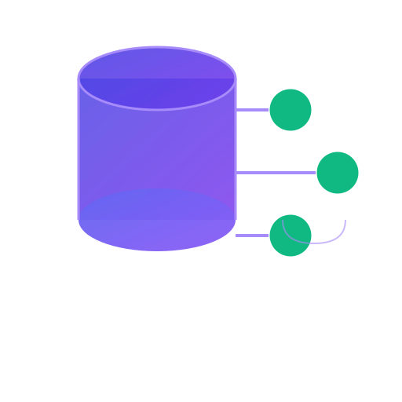

# 🧠 Honcho Shared Memory — Hermes Agent plugin

> Shared persistent memory for **Hermes Agent** through a self-hosted Honcho database.
> This is the Hermes counterpart of the Agent Zero plugin in this repo — **both agents read and write the same memory namespace** (same workspace, peer and session), so what Agent Zero stores, Hermes can recall and vice versa.

<p align="center">
  
</p>

| Feature | Description |
|---------|-------------|
| 💾 **Persistent Memory** | Store preferences, decisions, project context in Honcho |
| 🔍 **Smart Retrieval** | Semantic search over everything you (or Agent Zero) stored |
| 🧠 **Context Injection** | Pull relevant shared memories into your working context |
| 🤝 **Multi-Agent** | Same namespace as the Agent Zero plugin — true shared memory |
| 🕵️ **Secret Redaction** | Automatic detection and redaction of tokens/passwords before storage |
| 🔒 **Privacy First** | Everything opt-in; store only what you explicitly ask for |

---

## 🚀 Installation

### 1. Install the Python dependency

The plugin needs the official Honcho SDK in **Hermes' own virtualenv**:

```bash
~/.hermes/hermes-agent/venv/bin/pip install 'honcho-ai>=2.0.0'
```

(If you don't know where your Hermes venv is: `which hermes` → the venv is next to the binary.)

### 2. Install the plugin

Either clone the repo and symlink, or copy the `hermes-plugin/` folder:

```bash
# Option A: symlink (single source of truth, updates via git pull)
git clone https://github.com/jphermans/agent-zero-honcho-memory.git ~/projects/agent-zero-honcho-memory
ln -s ~/projects/agent-zero-honcho-memory/hermes-plugin ~/.hermes/plugins/honcho-shared-memory

# Option B: copy
cp -r ~/projects/agent-zero-honcho-memory/hermes-plugin ~/.hermes/plugins/honcho-shared-memory
```

### 3. Configure (environment variables)

The plugin reads configuration from environment variables. Defaults work for a **local Honcho on localhost:8000 with workspace `hermes`**:

| Variable | Default | Description |
|----------|---------|-------------|
| `HONCHO_BASE_URL` | `http://localhost:8000` | Your Honcho API |
| `HONCHO_WORKSPACE_ID` | `hermes` | Must match the Agent Zero plugin setting to share memory |
| `HONCHO_PEER_ID` | `hermes` | Peer identity in the workspace |
| `HONCHO_AGENT_ID` | `hermes` | How Hermes is labeled in stored memories |
| `HONCHO_API_KEY` | *(empty)* | Only if your Honcho instance uses auth |
| `HONCHO_TIMEOUT` | `30` | Request timeout (s) |
| `HONCHO_MAX_RETRIES` | `3` | Retry count |
| `HONCHO_RETRIEVAL_LIMIT` | `10` | Max search results |
| `HONCHO_RETRIEVAL_MAX_CHARS` | `8000` | Max context chars injected |
| `HONCHO_MAX_STORED_LENGTH` | `10000` | Max stored content length |
| `HONCHO_REDACT` | `true` | Redact secrets before storing |
| `HONCHO_TLS_VERIFY` | `true` | TLS verification |

Set them in your shell / systemd unit / `.env` before starting Hermes. To **share memory with Agent Zero**, use the same values as the Agent Zero plugin: same `HONCHO_WORKSPACE_ID` (e.g. `hermes`), same `HONCHO_PEER_ID`, and the default `default` session.

> 💡 No API key is needed for a local Honcho — storage and search work without any LLM configuration on the server (verified). The server's LLM config is only used for Honcho's own derived features (dialectic summaries), not by this plugin.

### 4. Enable and restart

```bash
hermes plugins enable honcho-shared-memory
hermes plugins list | grep honcho   # should show enabled
```

Then `/reset` (or exit and relaunch) so the tools load. The plugin's tools are **agent-called**, not slash commands:

| Tool | Purpose |
|------|---------|
| `honcho_test_connection` | Verify reachability + workspace + write/read |
| `honcho_store` | Explicitly store a memory |
| `honcho_search` | Semantic search over stored memories |
| `honcho_context` | Retrieve relevant context for a topic |
| `honcho_latest` | List the most recent stored messages |

Just tell Hermes what you want in plain language — e.g. *"remember that the PF6000 runs firmware 2.1"*, *"what did we store about the PF6000?"*, *"check honcho memory for that decision"*.

---

## 🧪 Testing

From the plugin directory (or anywhere, with `PYTHONPATH`):

```bash
python3 -c "
import sys; sys.path.insert(0, 'hermes-plugin')
import __init__ as hm
print(hm.honcho_test_connection())
"
```

Expected: a JSON result with `"success": true` and diagnostics `reachability/peer/write/read: ok`.

---

## 🗂️ Compatibility with Agent Zero

- Same workspace/peer/session conventions → memory is shared across agents.
- Hermes stores metadata in the minimal `hermes-agent` format, which the Agent Zero plugin reads natively (its `hermes-agent` compatibility mode).
- Works the other way too: Agent Zero stores in its own format; Hermes' search uses `skip_filters` so it finds everything regardless of metadata shape.

## 🔒 Security notes

- Never store passwords or API keys as memory — the plugin redacts common secret patterns before writing.
- The plugin never writes config or secrets to disk; everything comes from env vars.
